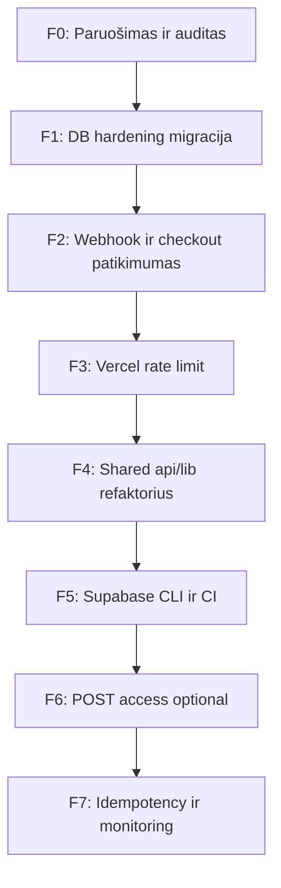

# Supabase integracijos patobulinimų planas (detalus)

**Data:** 2026-06-03  
**Kontekstas:** Analizė pagal repo būseną ir 2026 m. Supabase/GitHub gaires ([RLS docs](https://github.com/supabase/supabase/blob/master/apps/docs/content/guides/database/postgres/row-level-security.mdx), [Securing your API](https://supabase.com/docs/guides/api/securing-your-api), [Data API hardening](https://github.com/supabase/supabase/blob/master/apps/docs/content/guides/api/hardening-data-api.mdx)).  
**Principas:** Nelaužyti esamų kontraktų (`GET /api/access`, webhook upsert, checkout 409). Pirmiausia DB gynyba gylio, po to operacinis patikimumas, paskui refaktorius.

**Susiję dokumentai:** [supabase-migrations.md](supabase-migrations.md), [payment-best-practices.md](payment-best-practices.md), [security-audit-deep.md](security-audit-deep.md) §4.6, [access-architecture-canon.md](access-architecture-canon.md), [golden-legacy-standard.md](golden-legacy-standard.md).

---

## 1. Dabartinė būsena (baseline)

### 1.1 Kas veikia teisingai

| Sritis | Įgyvendinimas |
|--------|----------------|
| Architektūra | Backend-only: frontend **nenaudoja** Supabase; tik Vercel `api/*` ir FastAPI `backend/db.py` |
| Raktai | `SUPABASE_SERVICE_ROLE_KEY` tik serverio env; ne `VITE_*` |
| Duomenų modelis | Viena lentelė `user_access`: email (unique), highest_plan (0/3/6/12/15), stripe_customer_id |
| Verslo logika | Upsert `max(current, purchased)`; email `lower(trim())` visuose keliuose |
| Migracijos | `supabase/migrations/20260324120000_user_access_baseline.sql` (idempotent CREATE) |
| Testai | `backend/tests/test_api.py` – access 503, checkout 409 (mock Supabase) |

### 1.2 Spragos (prioritetuota)

| ID | Spraga | Rizika | Lūžta esamas flow? |
|----|--------|--------|---------------------|
| G1 | `user_access` be RLS; galimi default `GRANT` anon/authenticated | Duomenų nutekėjimas per publishable/anon raktą | Ne (jei tik RLS + REVOKE) |
| G2 | Data API įjungtas, nors klientas jo nenaudoja | Papildomas attack surface | Ne (Dashboard nustatymas) |
| G3 | Vercel API be rate limit (`access`, `generate-access-link`) | Email enumeracija, PII abuse | Ne |
| G4 | Webhook grąžina 200 kai Supabase upsert failina | Prarasta prieiga be Stripe retry | Ne (geresnis elgesys) |
| G5 | Checkout tęsiasi kai Supabase check failina (Vercel) | Double purchase / neteisingas 409 | Ne |
| G6 | `updated_at` neatsinaujina upsert metu | Operacinis triukšmas | Ne |
| G7 | Nėra CHECK ant `highest_plan` | Neteisingos reikšmės DB | Ne (jei duomenys validūs) |
| G8 | Supabase logika dubliuota 5 failuose | Drift tarp Vercel ↔ FastAPI | Ne |
| G9 | Email query string (`GET ?email=`) | Logai, history, enumeracija | Taip (jei keičiam į POST) |
| G10 | Nėra Supabase CLI / CI migracijų | Rankinės klaidos prod | Ne |

### 1.3 Failų žemėlapis (Supabase touchpoints)

```
supabase/migrations/          ← kanonas SQL
backend/db.py                   ← FastAPI Supabase klientas
backend/main.py                 ← GET /api/access, webhook upsert
api/access.js                   ← Vercel GET /api/access
api/stripe-webhook.js           ← Vercel webhook upsert
api/create-checkout-session.js  ← Vercel 409 check
api/generate-access-link.js     ← Vercel magic link lookup
frontend/src/api.js             ← kviečia /api/access, /api/generate-access-link
```

---

## 2. Fazės ir seka



**Rekomenduojama deploy seka:** F0 → F1 (staging → prod) → F2 → F3 → likusios pagal poreikį.

---

## 3. F0 – Paruošimas ir auditas (0.5 d.)

**Tikslas:** Žinoti tikrą prod/staging būseną prieš migraciją.

### 3.1 Užduotys

| # | Veiksmas | Kas daro | Rezultatas |
|---|----------|----------|------------|
| F0.1 | Supabase Dashboard → Table Editor → `user_access` → patikrinti stulpelius vs migracija | Operatorius | Schema atitikties protokolas |
| F0.2 | SQL Editor: `SELECT count(*), min(highest_plan), max(highest_plan) FROM user_access` | Operatorius | Duomenų sanity |
| F0.3 | Patikrinti ar yra mišrių raidžių email: `SELECT email FROM user_access WHERE email <> lower(trim(email))` | Operatorius | Jei >0 – vienkartinis UPDATE (žr. [supabase-user-access.sql](supabase-user-access.sql)) |
| F0.4 | Dashboard → Database → Roles / API: ar lentelė matoma per Data API | Operatorius | Dokumentuota dabartinė ekspozicija |
| F0.5 | Vercel env: `SUPABASE_URL`, `SUPABASE_SERVICE_ROLE_KEY` Production + Preview | Operatorius | Checklist ✓ |
| F0.6 | Rankinis smoke: LP „Patikrinti prieigą“ su žinomu email; Stripe test webhook | QA | Baseline veikia |

### 3.2 Priėmimo kriterijai

- [ ] Schema atitinka migraciją
- [ ] Nėra invalid `highest_plan` (ne 0,3,6,12,15)
- [ ] Smoke testai praeina prieš F1

---

## 4. F1 – DB hardening migracija (1 d., MUST)

**Tikslas:** Defense-in-depth pagal Supabase 2026 gaires; **service_role veikia kaip dabar** (RLS bypass).

### 4.1 Naujas migracijos failas

**Kelias:** `supabase/migrations/20260603120000_user_access_hardening.sql`

**Turinys (idempotent kur įmanoma):**

```sql
-- F1: RLS + revoke public API roles + constraints + updated_at trigger

-- 1) RLS (no policies = deny anon/authenticated via Data API)
alter table if exists public.user_access enable row level security;

-- 2) Explicit revoke (existing projects may have default grants)
revoke all on table public.user_access from anon, authenticated;

-- 3) Valid highest_plan values only
alter table public.user_access
  drop constraint if exists user_access_highest_plan_check;
alter table public.user_access
  add constraint user_access_highest_plan_check
  check (highest_plan in (0, 3, 6, 12, 15));

-- 4) updated_at on UPDATE
create or replace function public.set_updated_at()
returns trigger
language plpgsql
as $$
begin
  new.updated_at = now();
  return new;
end;
$$;

drop trigger if exists user_access_updated_at on public.user_access;
create trigger user_access_updated_at
  before update on public.user_access
  for each row execute function public.set_updated_at();
```

**Neįtraukti šioje fazėje (atskira migracija vėliau):** `citext` email – reikalauja extension ir duomenų migracijos.

### 4.2 Pritaikymo tvarka

1. **Staging / kopija** – paleisti migraciją SQL Editor arba `supabase db push`
2. **Smoke su service_role:**
   - `select` / `upsert` per esamą Vercel webhook test arba rankinis upsert
   - Patikrinti, kad `GET /api/access?email=...` grąžina tą patį
3. **Prod** – tik po staging sėkmės
4. Atnaujinti [supabase-user-access.sql](supabase-user-access.sql) santrauką (komentaras apie RLS)
5. Atnaujinti [supabase-migrations.md](supabase-migrations.md) – naujos migracijos aprašas

### 4.3 Optional: Data API išjungimas (Dashboard)

| Veiksmas | Vieta | Pastaba |
|----------|-------|---------|
| Disable Data API | Project Settings → API → Enable Data API **Off** | Jei **visi** skaitymai/rašymai tik per serverio `service_role` REST. Patvirtinti, kad niekas nenaudoja anon key. |

**Alternatyva:** palikti Data API, bet F1 RLS + REVOKE pakanka.

### 4.4 Rollback

```sql
-- Tik emergency; normaliai nereikia
alter table public.user_access disable row level security;
alter table public.user_access drop constraint if exists user_access_highest_plan_check;
drop trigger if exists user_access_updated_at on public.user_access;
-- GRANT atkūrimas – tik jei sąmoningai reikia anon prieigos (nerekomenduojama)
```

### 4.5 Priėmimo kriterijai

- [ ] Migracija pritaikyta staging + prod
- [ ] Webhook test → `user_access` atnaujinamas
- [ ] LP access check veikia
- [ ] Supabase Security Advisor: nėra „RLS disabled“ įspėjimo `user_access`
- [ ] `pytest` + `npm run build` (golden-legacy)

### 4.6 Agentas

- **Migracija SQL:** backend-agent arba operatorius
- **Doc:** atnaujinti INDEX, CHANGELOG po merge

---

## 5. F2 – Webhook ir checkout patikimumas (0.5–1 d., SHOULD)

**Tikslas:** Stripe retry kai DB failina; nuoseklus elgesys Vercel ↔ FastAPI.

### 5.1 `api/stripe-webhook.js`

| Dabar | Paskirtis |
|-------|-----------|
| Supabase nekonfigūruotas → `200` | Keisti → `503` (Stripe retry) arba alert; prod env visada turi turėti Supabase |
| Upsert error → log + `200` | Keisti → `500` (Stripe retry) |
| Sėkmė / ne mūsų event | `200` |

**Logika:**

```
if event !== checkout.session.completed → 200
if validation fail (no email/plan) → 200 (ne retry)
if supabase not configured → 503
if supabase read/upsert fail → 500
else → 200
```

**Failas:** `api/stripe-webhook.js` (eil. ~86–124)

### 5.2 `api/create-checkout-session.js`

| Dabar | Paskirtis |
|-------|-----------|
| Supabase check catch → tęsti checkout | Jei Supabase **sukonfigūruotas** ir check failina → `503` |
| Supabase nekonfigūruotas | Tęsti (dev režimas) – kaip dabar |

**Failas:** `api/create-checkout-session.js` (eil. ~83–98)

### 5.3 FastAPI atitikimas

Patikrinti `backend/main.py` `handle_checkout_completed` – ar loguoja pakankamai; upsert failure jau warning. Optional: webhook endpoint grąžintų 500 jei upsert failina (dabar gali skirtis nuo Vercel).

### 5.4 Testai

| Testas | Tipas |
|--------|-------|
| Webhook su mock Supabase error → 500 | Rankinis / unit (jei pridėsime) |
| Checkout su Supabase down → 503 | Rankinis |
| Esami `test_api.py` | `pytest` – nepalaužti |

### 5.5 Priėmimo kriterijai

- [ ] Stripe Dashboard test webhook su valid payload → 200 + DB update
- [ ] Simuliuota DB klaida → 500, Stripe rodo retry
- [ ] Golden-legacy webhook kontraktas nepažeistas (200 sėkmės atveju)

### 5.6 Agentas

**backend-agent** (Vercel `api/*.js` + optional `main.py`)

---

## 6. F3 – Vercel rate limiting (0.5 d., SHOULD)

**Tikslas:** Suvienodinti su FastAPI SlowAPI; sumažinti email enumeraciją.

### 6.1 Apimtis

| Endpoint | Limitas (siūlymas) | Pagrindimas |
|----------|-------------------|-------------|
| `GET /api/access` | 30/min IP | Atitinka abuse riziką; FastAPI 60/min – galima 30 Vercel |
| `GET /api/generate-access-link` | 20/min IP | Jautresnis (generuoja magic link) |
| `POST /api/create-checkout-session` | 30/min IP | FastAPI jau 30/min |

### 6.2 Implementacijos variantai

| Variantas | Privalumai | Trūkumai |
|-----------|------------|----------|
| **A. Vercel Firewall / WAF rate limit** | Be kodo; Dashboard | Reikia Pro/plano, konfigūracija atskirai |
| **B. `@upstash/ratelimit` + Redis** | Standartinė serverless praktika | Nauja priklausomybė, Upstash env |
| **C. In-memory Map per instance** | Paprasta, be deps | Silpna serverless (kelios instancijos) |
| **D. Vercel KV sliding window** | Native Vercel | KV setup |

**Rekomendacija:** pradėti **A** jei turite Firewall; kitaip **B** (Upstash) kaip industry standard serverless rate limit.

### 6.3 Shared helper

**Naujas failas (F3 arba F4):** `api/lib/rate-limit.js`

```javascript
// Pseudocode – implementacija pagal pasirinktą variantą
async function rateLimit(req, res, { key, limit, windowSec }) { ... }
```

### 6.4 Priėmimo kriterijai

- [ ] >limit užklausos → `429` su `Retry-After`
- [ ] Normalus LP naudojimas neblokuojamas
- [ ] Dokumentuota [security.md](security.md)

### 6.6 Agentas

**backend-agent** arba **fullstack-agent** (jei reikia env Upstash)

---

## 7. F4 – Shared Supabase helper (1 d., SHOULD)

**Tikslas:** Viena tiesa PLAN_VALUES, email normalizacija, get/upsert – mažiau drift.

### 7.1 Naujas modulis

**Kelias:** `api/lib/supabase-access.js`

**Eksportuojamos funkcijos:**

```javascript
const PLAN_VALUES = [3, 6, 12, 15];
const PHASE1_PLAN_VALUES = [3, 6];
const PLAN_ID_TO_VALUE = { '1': 3, '2': 6, '3': 12, '4': 15 };

function normalizeEmail(email) { ... }
function getSupabaseClient() { ... } // null if not configured
async function getUserAccess(supabase, email) { ... }
async function upsertUserAccess(supabase, { email, highestPlan, stripeCustomerId }) { ... }
function toPlanValue(planStr) { ... }
function buildAccessResponse(highestPlan) { ... } // allowed_modules, can_upgrade_to
```

### 7.2 Refaktorius

| Failas | Pakeitimas |
|--------|------------|
| `api/access.js` | import `getUserAccess`, `buildAccessResponse` |
| `api/stripe-webhook.js` | import `getUserAccess`, `upsertUserAccess`, `toPlanValue` |
| `api/create-checkout-session.js` | import `getUserAccess`, `planIdToValue` |
| `api/generate-access-link.js` | import `getUserAccess` |

**FastAPI:** palikti `backend/db.py` – Python stack atskiras; dokumentuoti, kad PLAN_VALUES turi atitikti `api/lib/supabase-access.js` (arba vėliau generuoti iš vieno JSON config).

### 7.3 Priėmimo kriterijai

- [ ] Visi 4 Vercel handleriai naudoja lib
- [ ] `npm run diagnose:dep0169` (arba rankinis require) – lib kraunasi
- [ ] Golden-legacy API atsakymai identiški
- [ ] `npm run build` frontend OK

### 7.4 Agentas

**backend-agent**

---

## 8. F5 – Supabase CLI ir CI migracijos (1 d., COULD)

**Tikslas:** Migracijos ne rankiniu SQL Editor, o reproducible pipeline.

### 8.1 Repo pakeitimai

| # | Veiksmas |
|---|----------|
| F5.1 | `supabase init` → `supabase/config.toml` (necommit'inti `.supabase/` – jau `.gitignore`) |
| F5.2 | `supabase link --project-ref <ref>` (lokaliai, ne repo) |
| F5.3 | Dokumentuoti [supabase-migrations.md](supabase-migrations.md): CLI workflow |
| F5.4 | Optional GitHub Action: `supabase db push` į staging on PR label `db-migrate` |

### 8.2 Priėmimo kriterijai

- [ ] Nauja migracija pritaikoma per CLI staging
- [ ] Procedūra dokumentuota operatoriui

### 8.3 Agentas

**backend-agent** + operatorius (Supabase dashboard prieiga)

---

## 9. F6 – POST /api/access (1–2 d., COULD, breaking optional)

**Tikslas:** Pašalinti email iš URL (S2 iš [security-audit-deep.md](security-audit-deep.md)).

### 9.1 Strategija (backward compatible)

1. Pridėti `POST /api/access` su body `{ "email": "..." }` – Vercel + FastAPI
2. Frontend `getAccess()` – naudoti POST
3. **Palikti GET** dar 1–2 release su `Deprecation` log; vėliau pašalinti
4. Magic link: `POST /api/generate-access-link` – ta pati seka

### 9.2 Failai

| Failas | Pakeitimas |
|--------|------------|
| `api/access.js` | POST handler + GET legacy |
| `backend/main.py` | POST route |
| `frontend/src/api.js` | POST fetch |
| `docs/golden-legacy-standard.md` | Atnaujinti kontraktą |
| `backend/tests/test_api.py` | POST testai |

### 9.3 Agentas

**fullstack-agent**

---

## 10. F7 – Idempotency ir monitoring (1–2 d., COULD)

### 10.1 Stripe event idempotency

**Nauja lentelė:** `stripe_webhook_events`

```sql
create table if not exists public.stripe_webhook_events (
  event_id text primary key,
  event_type text not null,
  processed_at timestamptz default now()
);
alter table public.stripe_webhook_events enable row level security;
revoke all on public.stripe_webhook_events from anon, authenticated;
```

**Webhook logika:** insert `event_id`; on conflict → 200 (jau apdorota).

### 10.2 Monitoring

| Signalas | Veiksmas |
|----------|----------|
| Webhook 500 spike | Vercel log alert / Sentry (S4) |
| Supabase upsert error log | `user_access upsert error` – threshold alert |
| Access 502 | Database error rate |

### 10.3 Agentas

**backend-agent**

---

## 11. 2026 Supabase platformos checklist (operacinis)

| Item | Terminas | Veiksmas |
|------|----------|----------|
| Nauji API keys (publishable + secret) | Iki ~2026 pabaigos | Dashboard → migruoti nuo legacy anon/service_role |
| Nauji projektai: no auto-expose tables | 2026-05-30+ | Naujiems projektams – explicit GRANT; esamam – F1 REVOKE |
| Security Advisor | Periodiškai | Dashboard → patikrinti RLS, exposed tables |
| Key rotation | Kas 6–12 mėn. | Rotuoti `SUPABASE_SERVICE_ROLE_KEY` / secret key; atnaujinti Vercel env |

---

## 12. Testų ir regresijos planas (visoms fazėms)

### 12.1 Automatiniai (privaloma prieš merge)

```bash
cd backend && pytest
cd frontend && npm run build
```

### 12.2 Rankiniai (po F1/F2)

| # | Scenarijus | Tikėtinas rezultatas |
|---|------------|---------------------|
| T1 | GET `/api/access?email=naujas@test.com` | `highest_plan: 0` |
| T2 | GET su email, kuris turi planą prod DB | `highest_plan: 3 arba 6` |
| T3 | Stripe test `checkout.session.completed` | `user_access` upsert, `updated_at` pasikeitė (po F1 trigger) |
| T4 | Checkout plan 1, jau turi plan 2 | 409 |
| T5 | „Eiti į mokymus“ su prieiga | magic link redirect |
| T6 | Anon key → `/rest/v1/user_access` (curl) | Tuščia / 401 po F1 |

### 12.3 Ką nepalaužti (golden-legacy)

- `GET /api/access` 503 kai Supabase nekonfigūruotas
- Checkout 409 „already purchased“
- Webhook 200 sėkmės atveju
- `metadata.plan` kaip plan_value string

---

## 13. Moscow santrauka (implementacijai)

| Prioritetas | Fazė | Effort | Vertė |
|-------------|------|--------|-------|
| **MUST** | F1 DB hardening | 1 d. | Apsauga nuo anon key nutekėjimo |
| **SHOULD** | F2 Webhook/checkout reliability | 0.5–1 d. | Mažiau prarastų pirkimų |
| **SHOULD** | F3 Rate limit Vercel | 0.5 d. | Abuse / enumeracija |
| **SHOULD** | F4 Shared lib | 1 d. | Maintainability |
| **COULD** | F5 CLI/CI | 1 d. | Operacinis saugumas |
| **COULD** | F6 POST access | 1–2 d. | PII / OWASP |
| **COULD** | F7 Idempotency + alerts | 1–2 d. | Stripe duplicates, ops |

**Minimalus saugus paketas (1–2 d.):** F0 + F1 + F2.

---

## 14. CHANGELOG ir doc atnaujinimai (po implementacijos)

| Po fazės | Atnaujinti |
|----------|------------|
| F1 | CHANGELOG, supabase-migrations.md, security-audit-deep §4.6 |
| F2 | deploy-and-webhook.md (retry elgsena), CHANGELOG |
| F3 | security.md |
| F4 | payment-best-practices.md (vienas JS lib) |
| F6 | golden-legacy-standard.md, test_api.py docs |

---

## 15. Sekantis žingsnis

1. Patvirtinti fazės prioritetą (rekomenduojama: **F1 → F2 → F3**).
2. Agent režime: sukurti `20260603120000_user_access_hardening.sql` ir pritaikyti staging.
3. Po F1 smoke – F2 pakeitimai `api/stripe-webhook.js` ir `create-checkout-session.js`.

*Dokumentas: docs/supabase-hardening-plan.md. Nuoroda: [docs/INDEX.md](INDEX.md).*
